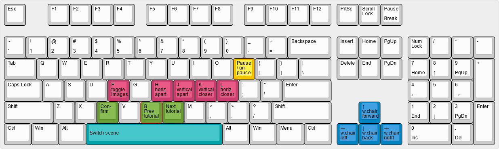
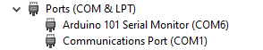

# TeleportVR

## How to install

1. Download the main branch of this repository
2. Open the Project with Unity 2020.3.1f1
3. Add the UnityPackage `UsedPlugins`, `SenseGloveSDK v1_2`, `Rewired1.1.39.U2020_Trial` and `Ultimate 10 Shaders` from the [Google Drive Folder](https://drive.google.com/drive/folders/1b-Ez4EaQvI0c8lEPN2esZWvLFtbvm95R) to the project. 
Not all of the plugins are needed, look at the Section [Plugins](#plugins) for more information
4. Add the Animus SDK to the project (>= Version 2.3.2, newer versions might fix some bugs but might not be compatible) from https://animus.cyberanimus.com/login. 
Make sure to uncheck `UnityAnimusClient.cs` and `ClientLogic.cs` in the import process.
5. In the Unity Project, add `ANIMUS_USE_OPENCV` to the Scripting Define Symbols in the Project settings
6. Add your credentials in the Script `AnimusPasswordStore.cs`
7. Open the scene Scenes/main
8. Enter your Robot name in the Editor by clicking on the GameObject ClientLogic in the Hierarchy window and set the name in the field 'Robot Name'
9. In the script AnimusUtilities.cs, insert the line `UnityAnimusClient.DisplayLatency(AverageLag, AverageFps);` in line 233
1. You are now be able to start and use the application!
1. For further functionality and support for more hardware, look at the section [Plugins](#plugins)

## Build Instructions
The App can be run on a computer without VR, with a PC VR headset (tested with the Quest) in the Editor or in a build. Furthermore, it can run (without RosSharp) standalone on the Oculus Quest. To build it, select the plattform you want to use in the BuildSettings, select the scenes you want to have in the build (e.g. Training for PC VR and TrainingMobile) in the order 

0. Main
1. Construct
2. HUD
3. Training

For non-Quest headsets or the VR Mock, it might be needed to change the XR-Plugin Management in the Project Settings.

## How to use
The tutorial in the app explains how to use the app. I can recommend to use the Tutorial if you have a headset. If not available, here is a short overview of interactions:
* Press space or the left menu button to switch between the training and the HUD
* Hover the right laser over the connection widget and press the left mouse button or right trigger to unfold the child widget
* Click again on the widget to fold in the child widget
* Hover the right laser over the connection widget and press the left mouse button or right trigger to interact with them (e.g. mute)
* Press the left/right grip trigger to open or close the left/right body hand
* Press the left/right index trigger to move the left/right arm
* Use the joystick or arrow keys to move around the wheelchair
* Use the joystick and Primary and secondary controller buttons to move the displays after clicking the Display widget
* Show emotions by pressing the Primary or Secondary buttons on the controllers
* If rossharp is installed and enabled and the cage is running, press both grip triggers simulatneously while performing the initial pose (put down both hands next to your hips) to send the init messagee to the cage

### Keyboard Bindings

In case not all external input devices are available, the following keyboard shortcuts are provided to interact with the game. However, you need to have selected the Unity Editor / built Application for them to register. ([Permalink](http://www.keyboard-layout-editor.com/##@@=Esc&_x:1%3B&=F1&=F2&=F3&=F4&_x:0.5%3B&=F5&=F6&=F7&=F8&_x:0.5%3B&=F9&=F10&=F11&=F12&_x:0.25%3B&=PrtSc&=Scroll%20Lock&=Pause%0ABreak%3B&@_y:0.5%3B&=~%0A%60&=!%0A1&=%2F@%0A2&=%23%0A3&=$%0A4&=%25%0A5&=%5E%0A6&=%2F&%0A7&=*%0A8&=(%0A9&=)%0A0&=%2F_%0A-&=+%0A%2F=&_w:2%3B&=Backspace&_x:0.25%3B&=Insert&=Home&=PgUp&_x:0.25%3B&=Num%20Lock&=%2F%2F&=*&=-%3B&@_w:1.5%3B&=Tab&=Q&=W&=E&=R&=T&=Y&=U&=I&=O&_c=%23f8c200%3B&=Pause%0Apause%0A%0A%0A%0A%0A%2F%2F%20un-&_c=%23cccccc%3B&=%7B%0A%5B&=%7D%0A%5D&_w:1.5%3B&=%7C%0A%5C&_x:0.25%3B&=Delete&=End&=PgDn&_x:0.25%3B&=7%0AHome&=8%0A%E2%86%91&=9%0APgUp&_h:2%3B&=+%3B&@_w:1.75%3B&=Caps%20Lock&=A&=S&=D&_c=%23cb3d6e%3B&=F%0Aimages%0A%0A%0A%0A%0Atoggle&_c=%23cccccc%3B&=G&_c=%23cb3d6e%3B&=H%0Aapart%0A%0A%0A%0A%0Ahoriz.&=J%0Aapart%0A%0A%0A%0A%0Avertical&=K%0Acloser%0A%0A%0A%0A%0Avertical&=L%0Acloser%0A%0A%0A%0A%0Ahoriz.&_c=%23cccccc%3B&=%2F:%0A%2F%3B&=%22%0A'&_w:2.25%3B&=Enter&_x:3.5%3B&=4%0A%E2%86%90&=5&=6%0A%E2%86%92%3B&@_w:2.25%3B&=Shift&=Z&=X&_c=%23689b34%3B&=Con-%0A%0A%0A%0A%0A%0Afirm&_c=%23cccccc%3B&=V&_c=%23689b34%3B&=B%0Atutorial%0A%0A%0A%0A%0APrev&=Next%0A%0A%0A%0A%0A%0Atutorial&_c=%23cccccc%3B&=M&=%3C%0A,&=%3E%0A.&=%3F%0A%2F%2F&_w:2.75%3B&=Shift&_x:1.25&c=%230084c2%3B&=%E2%86%91%0Aforward%0A%0A%0A%0A%0Aw.chair&_x:1.25&c=%23cccccc%3B&=1%0AEnd&=2%0A%E2%86%93&=3%0APgDn&_h:2%3B&=Enter%3B&@_w:1.25%3B&=Ctrl&_w:1.25%3B&=Win&_w:1.25%3B&=Alt&_c=%2300a4a9&a:6&w:6.25%3B&=Switch%20scene&_c=%23cccccc&a:4&w:1.25%3B&=Alt&_w:1.25%3B&=Win&_w:1.25%3B&=Menu&_w:1.25%3B&=Ctrl&_x:0.25&c=%230084c2%3B&=%E2%86%90%0Aleft%0A%0A%0A%0A%0Aw.chair&=%E2%86%93%0Aback%0A%0A%0A%0A%0Aw.chair&=%E2%86%92%0Aright%0A%0A%0A%0A%0Aw.chair&_x:0.25&c=%23cccccc&w:2%3B&=0%0AIns&=.%0ADel))

### Changing between Controllers and Mouse input
* Go to the scene Scenes/HUD
* In the editor in the Hierarchy window, go the object HUD_Managers/PointerManager and set the Pointer Technique to the required Input (e.g. controller for oculus touch)
* Go back to Scenes/AnimusOUI
* Under the XR Rig, make sure the HandAnchors are enabled if you want to use controllers. You can disable them if you are using the mouse as input.

## Known Problems
* The animus connection is often not working. There are many problems from animus, that can crash or freeze the application. Furthermore, some modalities are sometimes not opening. Try restarting the App, Unity, your computer, the animus server or the pybullet simulation on the server computer.
* Runnning Animus, Unity XR Interaction and Rossharp on android crashes the app after a few seconds, most likely because animus and rossharp need different versions of the same dll's.
* If Unity gives a lot of compile errors that say UnityEngine.UI or similar is unknown, try to reimport the Package UnityUI. If it persists, try restarting your coomputer and look if the file Packages/UnityUI/Editor/UnityEditor.UI is showing errors in the editor.
* I think Mouse Input for the laser is currently not working in the editor. This might be because some settings are not correctly set.
* The help widget might not work as expected.
* The headset control widget is currently not implemented, since the head control implementation was changed. The functionality should be added to the WidgetInteractions script.
* The microphone functionality might not work, as it might disable the micro for Unity, not for animus. I never had a chance to test it, so I can't say if it will work or not.
* The sound widget is currently not working, as animus is not providing the utility to open and close modalities.
* When using the app with Oculus Link, you might disconnect often. This might be caused by a bad cable.
* When using Oculus Link, Unity might show a black screen, flimmer, or not start. Try restarting the app, Unity or your PC. 
* Oculus Link sometimes does not allow to reset the view. Neiither restarting the Quest nor my Laptop did help here, but after some time it usually works again.
* A ROS message is not received by either side: ROS messages should not contain Timestamps or Durations, as these Ros Types are not supported for RosSharp and ROS 2
* When entering the HUD through the portal it is currently only possible to get back into the training by simulataneously pushing the left joystick back in the HUD and pressing the system menu, as the operator respawns in the same location where he left the Training. When leaving through the portal this means he’s still in the portal and thus get’s directly back into the HUD, if he isn’t moving backwards.
* When importing Animus, it is easy reimport the UnityAnimusClient.cs and ClientLogic.cs script. This will delete the current versions of the files and replace them with the animus versions. To get back to the version of the latest git commit, you can reset the changes to these scripts in git.

## Plugins

### RosSharp

RosSharp is a Plugin that allows to use Ros in C#. It works on Windows and can work on Android. However, as it is using some dll's Animus is also using with different versions, the android app crashes when having Animus, Rossharp and Unity XR in the project. RosSharp is currently used for the Interface to the cage, and is thus needed if the cage is used. If the cage is not used, RosSharp can be removed, so that the App can run on android. To install or removed RosSharp, perform the following steps:

Installation:
* Import the "UsedPlugins" from the Google Drive Folder https://drive.google.com/drive/folders/1b-Ez4EaQvI0c8lEPN2esZWvLFtbvm95R and only check the Folder RosSharp
* Import the two UnityPackages that are stored under Assets, FaceRosMessages and RosMessages and add everything to the project, if it is not yet part of the project.
* Add `ROSSHARP` to the Scripting Define Symbols in the Project settings

Removal:
* Remove `ROSSHARP` from the Scripting Define Symbols in the Project settings
* Remove the Folders Assets/RosSharpMessages and Assets/RoboyUnityFace
* (optional) Delete the Folder Assets/OperatorUserInterface/Plugins/RosSharp

### Portals

The Portals Package can give out errors that will sometimes cause the building process to fail. It can be installed from the "UsedPackages" UnityPackage and can be removed by deleting the Folder Assets/OperatorUserInterface/Plugins/PortalsPackage

### SenseGlove

If you want to use SenseGlove hand controllers to individually control each of Roboy's fingers, you need to: 
1. Install the the package `SenseGloveSDK v1_2.unitypackage` from the [Google Drive Folder](https://drive.google.com/drive/folders/1b-Ez4EaQvI0c8lEPN2esZWvLFtbvm95R).
3. Then set the Scripting Define Symbol `SENSEGLOVE` in the player settings.
4.  Import all files from the package and start the Training scene. 
If the SenseGloves were detected correctly on your system, you'll be able to control Roboy's fingers.

### Rudder Pedals

To use the rudder pedals with presence detection, connect both the pedals and the Arduino via USB to the host PC. Then follow these steps: 
1. Make sure the unity package `Rewired` from the [Google Drive Folder](https://drive.google.com/drive/folders/1b-Ez4EaQvI0c8lEPN2esZWvLFtbvm95R) is installed.
1. Set the scripting define symbol `RUDDER` in the player settings.
2. Determine the Arduino's assigned serial port. 
	This can be done on Windows by running Device Manager where the Arduino 101 should show up under `Ports (COM & LPT)`
 
	

	In the above example the correct serial port would be `COM6`.
4.  Enter the correct serial port in the `GameObject` in `Managers/PresenceDetector` in the `Main` scene.
5.  Pause the game by taking any of your feet off the pedals. 
(Known Issue: The game is only paused if both feet were one the pedals at some point in time before pausing.)

### Hardware

If you want to use hardware that was implemented for the Vive Pro Eye and XTal, but is not used with the Oculus Quest, download the UnityPackage "UnusedHardarePlugins" from the Google Drive Folder https://drive.google.com/drive/folders/1b-Ez4EaQvI0c8lEPN2esZWvLFtbvm95R. In the Unity Project, add the corresponding symbols to the Scripting Define Symbols in the Project settings:
* `TOBII`
* `BHAPTICS`
* `VIVESR`
* `UNITY_POST_PROCESSING_STACK_V2`

### Others

There are a few more packages that I think can be removed without getting compile errors and installed via the UsedPlugins package, but I didn't try it. The plugins are the really old Showroom Assets/OperatorUserInterface/Plugins/PBR_Modern_room and the old Showrrom Assets/OperatorUserInterface/Plugins/ShowRoom and the current ShowRoom (will remove the visuals in the Trainings scene) Assets/OperatorUserInterface/Plugins/"_Creepy_Cat". Removing the Plugins might reduce building times.
